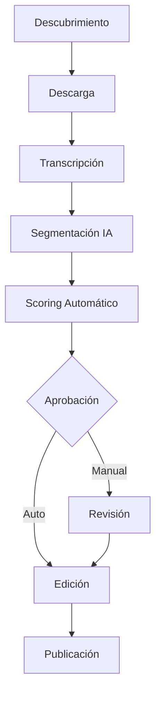

# 🎬 YT Shorts Dual Panel Agent

**Sistema inteligente de automatización para creación y publicación de YouTube Shorts**

Un pipeline completo que descubre, procesa, edita y publica automáticamente contenido de YouTube Shorts con IA integrada, scoring automático y múltiples interfaces de control.

## 🌟 Características Principales

### 🤖 **Pipeline Automatizado Completo**
- **Descubrimiento automático** de contenido desde canales configurados
- **Transcripción y segmentación** inteligente con IA
- **Edición automática** con layouts duales y subtítulos
- **Sistema de revisión** con aprobación manual/automática
- **Publicación programada** en YouTube

### 🧠 **IA y Scoring Inteligente**
- **ContentScorer**: 4 métricas de evaluación automática
  - Calidad del contenido
  - Potencial viral
  - Engagement esperado
  - Relevancia temática
- **TemplateManager**: 4 plantillas dinámicas
  - Gaming intenso
  - Educativo profesional
  - Entretenimiento casual
  - Tecnología moderna

### 🎛️ **Interfaces Múltiples**
- **Bot de Telegram**: 21 comandos completos
- **Interfaz Web**: Dashboard visual en tiempo real
- **CLI Control**: Línea de comandos para administradores
- **Gestión manual**: Añadir canales y videos manualmente

### 📊 **Sistema de Base de Datos**
- SQLite optimizada con migraciones automáticas
- Tracking completo del pipeline
- Estadísticas y métricas detalladas
- Gestión de canales y videos

## 🚀 Instalación Rápida

### Prerrequisitos
- Python 3.8+
- FFmpeg
- Git

### Configuración Automática
```bash
# Clonar repositorio
git clone https://github.com/Dreiko98/YT-Shorts-Dual-Panel-Agent.git
cd YT-Shorts-Dual-Panel-Agent

# Instalar dependencias
pip install -r requirements.txt

# Configurar entorno
make setup

# Ejecutar
make run
```

## 🎯 Uso Rápido

### 🤖 Bot de Telegram
```bash
# Configurar token en configs/
python src/bot.py
```
**Comandos principales:**
- `/start` - Inicializar bot
- `/pipeline` - Ejecutar pipeline completo
- `/queue` - Ver cola de shorts
- `/approve` - Aprobar contenido
- `/stats` - Estadísticas del sistema

### 🌐 Interfaz Web
```bash
python web_interface.py
# Acceder: http://localhost:8081
```

### 💻 CLI Control
```bash
python cli_control.py
```

## 📁 Estructura del Proyecto

```
YT-Shorts-Dual-Panel-Agent/
├── src/                    # Código fuente principal
│   ├── pipeline/          # Pipeline de procesamiento
│   │   ├── db.py         # Base de datos y ORM
│   │   ├── transcribe.py # Transcripción con IA
│   │   ├── segmenter.py  # Segmentación inteligente
│   │   ├── editor.py     # Edición de videos
│   │   └── layout.py     # Layouts y composición
│   └── utils/            # Utilidades y helpers
├── configs/              # Configuraciones
│   ├── channels.yaml    # Canales a monitorear
│   ├── layout.yaml      # Configuración de layouts
│   ├── branding.yaml    # Marca y estilo
│   └── publish.yaml     # Configuración de publicación
├── assets/              # Recursos y plantillas
├── data/               # Base de datos y archivos temporales
├── tests/              # Pruebas automatizadas
├── web_interface.py    # Interfaz web
├── cli_control.py      # Interfaz CLI
└── Makefile           # Comandos de automatización
```

## 🔧 Configuración

### 1. **Configuración de Canales**
```yaml
# configs/channels.yaml
channels:
  - id: "UCxxxxxxxxxxxxxxxxxxxxx"
    name: "Mi Canal"
    priority: high
    max_videos: 50
```

### 2. **Layouts Personalizados**
```yaml
# configs/layout.yaml
layouts:
  dual_panel:
    main_video: { x: 0, y: 0, width: 1080, height: 1080 }
    secondary: { x: 0, y: 1080, width: 1080, height: 840 }
    subtitles: { position: "center", style: "modern" }
```

### 3. **Configuración de IA**
```yaml
# configs/scoring.yaml
content_scorer:
  enabled: true
  auto_approve_threshold: 0.8
  metrics: ["quality", "viral", "engagement", "relevance"]
```

## 🎨 Personalización

### Plantillas de Video
El sistema incluye 4 plantillas predefinidas:

1. **🎮 Gaming Intenso**
   - Colores vibrantes (rojo/negro)
   - Subtítulos dinámicos
   - Efectos de alta energía

2. **📚 Educativo Profesional**
   - Paleta azul corporativa
   - Tipografía clara
   - Diseño limpio

3. **🎭 Entretenimiento Casual**
   - Colores cálidos
   - Estilo relajado
   - Animaciones suaves

4. **💻 Tecnología Moderna**
   - Esquema oscuro
   - Acentos cyan
   - Estética futurista

### Scoring Personalizado
```python
# Ejemplo de métrica personalizada
def custom_metric(video_data):
    score = 0.0
    # Tu lógica de scoring aquí
    return min(1.0, max(0.0, score))
```

## 📊 Monitoreo y Estadísticas

### Dashboard Web
- ⏱️ **Tiempo real**: Actualización automática cada 30s
- 📈 **Métricas**: Pendientes, aprobados, publicados
- 🔄 **Cola**: Visualización completa del pipeline
- 📅 **Programación**: Calendario de publicaciones

### Estadísticas CLI
```bash
# Ver estadísticas completas
python cli_control.py -> opción 1

# Métricas específicas
python -c "from src.pipeline.db import PipelineDB; print(PipelineDB().get_detailed_stats())"
```

## 🔄 Flujo de Trabajo



## 🛠️ Comandos Make

```bash
make setup       # Configuración inicial
make run         # Ejecutar sistema completo  
make test        # Ejecutar pruebas
make clean       # Limpiar archivos temporales
make deploy      # Despliegue en producción
make backup      # Respaldo de base de datos
```

## 🧪 Pruebas

```bash
# Ejecutar todas las pruebas
make test

# Pruebas específicas
python -m pytest tests/test_transcription_segmentation.py -v
python -m pytest tests/test_composition.py -v
python -m pytest tests/test_basic.py -v
```

## 📚 Documentación Adicional

- [📹 **Guía de Videos**](VIDEOS_GUIDE.md) - Tutorial paso a paso
- [🔄 **Workflow Detallado**](WORKFLOW.md) - Proceso completo del pipeline
- [🗺️ **Roadmap**](ROADMAP_NEXT_PHASES.md) - Próximas funcionalidades

## 🐛 Solución de Problemas

### Errores Comunes

**Error: FFmpeg no encontrado**
```bash
# Ubuntu/Debian
sudo apt install ffmpeg

# macOS
brew install ffmpeg

# Windows
# Descargar desde https://ffmpeg.org/download.html
```

**Error: Permisos de base de datos**
```bash
chmod 755 data/
chmod 666 data/*.db
```

**Error: Dependencias Python**
```bash
pip install --upgrade -r requirements.txt
```

### Logs y Debugging
```bash
# Ver logs en tiempo real
tail -f logs/pipeline.log

# Logs detallados
python src/cli.py --debug
```

## 🤝 Contribuir

1. Fork el proyecto
2. Crear rama de feature (`git checkout -b feature/AmazingFeature`)
3. Commit cambios (`git commit -m 'Add AmazingFeature'`)
4. Push a la rama (`git push origin feature/AmazingFeature`)
5. Abrir Pull Request

### Estándares de Código
- PEP 8 para Python
- Documentación en español
- Tests para nuevas funcionalidades
- Commits descriptivos

## ✅ Estado de Desarrollo

### 🎯 **Completado (100%)**
- ✅ **Pipeline Core**: Base de datos, CLI, configuración
- ✅ **Transcripción IA**: Whisper integrado con múltiples modelos
- ✅ **Segmentación Inteligente**: Análisis de contenido y clips automáticos
- ✅ **Editor Avanzado**: Layouts duales, subtítulos, composición
- ✅ **Interfaces Múltiples**: Telegram (21 comandos), Web, CLI
- ✅ **IA y Scoring**: ContentScorer + TemplateManager
- ✅ **Gestión Manual**: Canales y videos desde interfaces
- ✅ **Suite de Tests**: 36+ pruebas automatizadas

### 🚧 **En Desarrollo**
- 🔄 **Descarga Automática**: Integración yt-dlp
- 🔄 **Publicación YouTube**: API OAuth
- 🔄 **Monitoreo Avanzado**: Métricas en tiempo real

## 📄 Licencia

Este proyecto está bajo la Licencia MIT. Ver [LICENSE](LICENSE) para más detalles.

## 🏆 Créditos

- **Desarrollador Principal**: Dreiko98
- **IA y Transcripción**: OpenAI Whisper
- **Edición de Video**: FFmpeg
- **Base de Datos**: SQLite

## 📞 Soporte

- 🐛 **Issues**: [GitHub Issues](https://github.com/Dreiko98/YT-Shorts-Dual-Panel-Agent/issues)
- 💬 **Discusiones**: [GitHub Discussions](https://github.com/Dreiko98/YT-Shorts-Dual-Panel-Agent/discussions)
- 📧 **Email**: [Contacto directo]

## ⭐ Agradecimientos

Si este proyecto te ha sido útil, ¡considera darle una estrella! ⭐

---

**🚀 ¡Automatiza tu creación de contenido con IA y lleva tus YouTube Shorts al siguiente nivel!**
